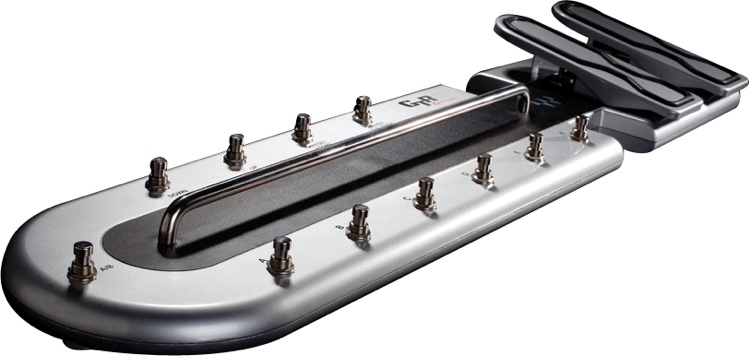

The Waves GTR Ground is a MIDI foot controller with 11 buttons and 2 foot pedals. It has three 15-segment LEDs for seven buttons, plus two LEDs and brightness control for the LEDs.

The device is a USB MIDI compliant device with a USB Vendor ID of 0x6824 and a USB Product ID of 0x0100. My device returned Version " 1.01" and "Waves Audio LTD." as the Manufacturer. The MIDI properties for my device are:

- SerialNumber = "Ver. 1.4";
- Manufacturer = "Waves Audio LTD.";
- Model = "GTR Ground Ver 1.4";
- Name = "GTR Ground Ver 1.4";

The following MIDI events are send from the device:

- MIDI CC 0x0E = Right Pedal (0x00..0x7F)
- MIDI CC 0x0F = Left Pedal (0x00..0x7F)
- MIDI CC 0x10 = Button 'A' (0x7F: pushed down, 0x00:released)
- MIDI CC 0x11 = Button 'B' (0x7F: pushed down, 0x00:released)
- MIDI CC 0x12 = Button 'C' (0x7F: pushed down, 0x00:released)
- MIDI CC 0x13 = Button 'D' (0x7F: pushed down, 0x00:released)
- MIDI CC 0x14 = Button 'E' (0x7F: pushed down, 0x00:released)
- MIDI CC 0x15 = Button 'F' (0x7F: pushed down, 0x00:released)
- MIDI CC 0x16 = Button A/B (0x7F: pushed down, 0x00:released)
- MIDI CC 0x17 = Button Down (0x7F: pushed down, 0x00:released)
- MIDI CC 0x18 = Button Up (0x7F: pushed down, 0x00:released)
- MIDI CC 0x19 = Button Preset/Stomp (0x7F: pushed down, 0x00:released)
- MIDI CC 0x1A = Button Tuner/Tap Tempo (0x7F: pushed down, 0x00:released)

To control the LEDs on the device, a USB Real Time message can be send to the device:
The message is always 48 bytes long, all unused bytes are set to 0x00, the last byte is 0xF7.

    0xF0, 0x7F, 0x00, 0x20, 0x66, <type>, <variable data>, 0x00*, 0xF7

An example
----------
All LED segments on for button A (1st event), LED to max brightness (2nd event), both A/B LEDs on (3rd event)

    F0 7F 00 20 66 41 00 38 7F 7F 7F 7F 7F 7F 00 00
    00 00 00 00 00 00 00 00 00 00 00 00 00 00 00 00
    00 00 00 00 00 00 00 00 00 00 00 00 00 00 00 F7
    F0 7F 00 20 66 51 0F 00 00 00 00 00 00 00 00 00
    00 00 00 00 00 00 00 00 00 00 00 00 00 00 00 00
    00 00 00 00 00 00 00 00 00 00 00 00 00 00 00 F7
    F0 7F 00 20 66 62 03 00 00 00 00 00 00 00 00 00
    00 00 00 00 00 00 00 00 00 00 00 00 00 00 00 00
    00 00 00 00 00 00 00 00 00 00 00 00 00 00 00 F7

Controlling the LEDs next to A/B button
---------------------------------------

- 0x62, 0x01 = B LED on
- 0x62, 0x02 = A LED on
- 0x62, 0x03 = A LED and B LED on

Controlling the brightness of the LED displays
----------------------------------------------

- 0x51, value  Brightness for 'A'
- 0x52, value  Brightness for 'B'
- 0x53, value  Brightness for 'C'
- 0x54, value  Brightness for 'D'
- 0x55, value  Brightness for 'E'
- 0x56, value  Brightness for 'F'
- 0x57, value  Brightness for Preset

value =

- 0x00 .. 0x07 LEDs off
- 0x08 .. 0x0F Brightness (dark ... bright)

Setting the segments in the LED displays
----------------------------------------

- 0x41  Set LED Text above the 'A' button
- 0x42  Set LED Text above the 'B' button
- 0x43  Set LED Text above the 'C' button
- 0x44  Set LED Text above the 'D' button
- 0x45  Set LED Text above the 'E' button
- 0x46  Set LED Text above the 'F' button
- 0x47  Set LED Text below the Preset button

There are the 3 15 Segment-LEDs per button:

      -     -     -      A
    |\|/| |\|/| |\|/|  BCDEF
     - -   - -   - -    G H
    |/|\| |/|\| |/|\|  IJKLM
      - .   - .   - .    N  O
     1st   2nd   3rd

The 'A' to 'O' above are the references to a specific LED segment.

The format is as followed:

    1. Byte
        0x00 (this byte seems to be unused and always 0x00)
    2. Byte (by bits)
        6 - (unused)
        5 - Dot behind the 3rd segment
        4 - Dot behind the 2nd segment
        3 - Dot behind the 1st segment
        2 - (unused)
        1 - (unused)
        0 - (unused)
    3. Byte (by bits) (1. LED)
        6 - G (left middle bar)
        5 - B
        4 - I
        3 - N (the 6 outside segments, counter clockwise)
        2 - M
        1 - F
        0 - A
    4. Byte (by bits)
        6 - J
        5 - K
        4 - L
        3 - E (the 6 inside segments, counter clockwise)
        2 - D
        1 - C
        0 - H (right middle bar)
    5. Byte (by bits) (2. LED)
        6 - G (left middle bar)
        5 - B
        4 - I
        3 - N (the 6 outside segments, counter clockwise)
        2 - M
        1 - F
        0 - A
    6. Byte (by bits)
        6 - J
        5 - K
        4 - L
        3 - E (the 6 inside segments, counter clockwise)
        2 - D
        1 - C
        0 - H (right middle bar)
    7. Byte (by bits) (3. LED)
        6 - G (left middle bar)
        5 - B
        4 - I
        3 - N (the 6 outside segments, counter clockwise)
        2 - M
        1 - F
        0 - A
    8. Byte (by bits)
        6 - J
        5 - K
        4 - L
        3 - E (the 6 inside segments, counter clockwise)
        2 - D
        1 - C
        0 - H (right middle bar)
